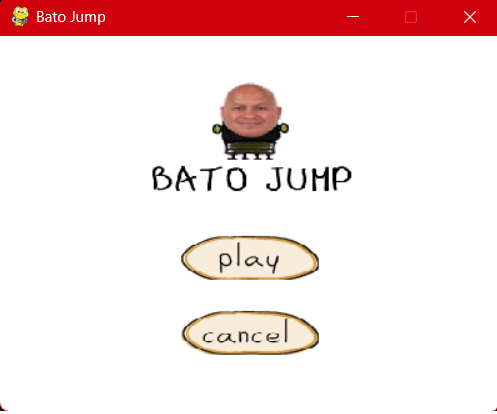

# Bato-Jump



**Bato-Jump** is a fun and interactive 2D jumping game inspired by Doodle Jump and built using Python, OpenCV, and Pygame. The game uses your webcam to detect your face, and you control the player by moving your head left and right. Jump from platform to platform, avoid falling, and rack up your score!

## Features

- **Face Detection**: The game uses OpenCV's Haar Cascade classifier to detect faces and move the player based on the position of your face in front of the webcam.
- **Jumping Mechanic**: When the player lands on a platform, they "jump" to the next platform, and the platforms scroll upwards as the game progresses.
- **Dynamic Platform Generation**: Platforms appear above the current screen level as the player progresses upward, providing a continuous challenge.
- **Game Over Condition**: The game ends when the player falls off the screen, and the final score is displayed.
- **Sound Effects**: Sound effects like jump sounds, background music, and a game over sound add to the experience.

## Setup

```bash
pip install -r requirements.txt
python main.py
```

Move your head left and right to steer. Press `q` to quit a run.

## Project layout

```
main.py                 entry point (menu -> game -> menu)
batojump/
  config.py             constants, asset paths
  world.py              pure game state and physics (no I/O)
  face_tracker.py       webcam capture + Haar-cascade face detection
  renderer.py           sprite overlay and HUD drawing
  audio.py              sound effects and music
  menu.py               pygame start menu
  game.py               play session tying the pieces together
tests/                  headless tests for world and rendering helpers
```

Run tests with `pip install pytest && python -m pytest tests`.
