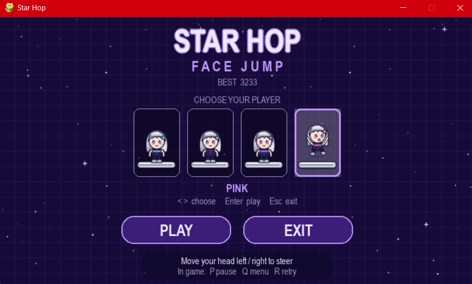

# Star Hop



**Star Hop** is a fun and interactive 2D jumping game inspired by Doodle Jump and built using Python, OpenCV, and Pygame. The game uses your webcam to detect your face, and you control the player by moving your head left and right. Jump from platform to platform, avoid falling, and rack up your score!

## Features

- **Face Detection**: The game uses OpenCV's YuNet neural face detector (`models/face_detection_yunet_2023mar.onnx`) to detect faces and move the player based on the position of your face in front of the webcam.
- **Jumping Mechanic**: When the player lands on a platform, they "jump" to the next platform, and the platforms scroll upwards as the game progresses.
- **Dynamic Platform Generation**: Platforms appear above the current screen level as the player progresses upward, providing a continuous challenge.
- **Game Over Condition**: The game ends when the player falls off the screen, and the final score is displayed.
- **Sound Effects**: Sound effects like jump sounds, background music, and a game over sound add to the experience.

## Why YuNet?

Steering depends on a face detector that runs on every frame, so the model had to be accurate, fast on a CPU and easy to ship. I chose OpenCV's YuNet because:

- **More robust than Haar cascades**: the original version used a Haar cascade, which mostly handles frontal faces in good light. YuNet is a small convolutional neural network, so it copes much better with tilted heads, glasses, partial occlusion and uneven lighting.
- **Fast on CPU**: the model is only about 230 KB, so detection fits comfortably in a real-time game loop without a GPU.
- **No extra dependencies**: it is built into OpenCV (`cv2.FaceDetectorYN`, OpenCV 4.5.4 or newer). Alternatives like MediaPipe, dlib or a PyTorch detector add large installs, while YuNet needs only the one model file in `models/`.
- **Confidence scores and landmarks**: each detection includes a score and five facial landmarks (eyes, nose, mouth corners). The score lets us filter weak detections, and the landmarks leave room for head-tilt steering later.
- **Permissive license**: it is distributed through the OpenCV Zoo under the MIT license, so it is safe to bundle with the project.

## Setup

```bash
pip install -r requirements.txt
python main.py
```

Pick a member on the menu, then move your head left and right to steer. `P` pauses, `Q` returns to the menu, and `R`/Space retries after game over.

Sprites live in `assets/img/sprites/` (several unused ones, such as enemies, items and special platforms, are ready for future features).

## Limitations

- **Dependent on camera quality**: Steering relies entirely on face detection from your webcam. A low-resolution camera, poor or uneven lighting, a cluttered background, or a face that is turned away or partly covered can make detection jittery or lose the face altogether, which makes the player harder to control. For the best experience, use a decent webcam in a well-lit room and face it directly.
- **Single player, head position only**: The game locks onto the largest face when it starts tracking and keeps following that person, but only head position controls it. If your face is lost for about half a second, it locks onto whoever is largest next, which can be someone else.
- **Detector weakness**: YuNet is much more robust than a Haar cascade, but it still struggles with heavy occlusion, extreme angles, strong backlighting and very low resolution, and can occasionally pick up false positives in the background.
- **Frame rate**: Detection runs on every frame on the CPU. On a slow machine the frame rate drops, and because the physics is tied to frames, the game then runs in slow motion.
- **No calibration**: A user sitting far from the camera has to lean a long way to reach the screen edges, because the whole camera width maps to the play area.
- **Face lost**: The player simply stops moving until the face is found again. It still falls and can die.

## Project layout

```
main.py                 entry point (menu -> game -> menu)
starhop/
  config.py             constants, asset paths
  world.py              pure game state and physics (no I/O)
  face_tracker.py       webcam capture + YuNet face detection with lock-on
  renderer.py           sprite overlay and HUD drawing
  audio.py              sound effects and music
  highscore.py          saved best score
  menu.py               pygame start menu
  game.py               play session tying the pieces together
models/                 YuNet face detection model (ONNX)
tests/                  headless tests for world and rendering helpers
```

Run tests with `pip install pytest && python -m pytest tests`.
